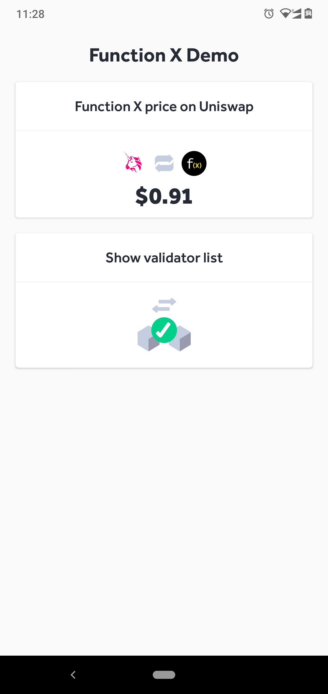
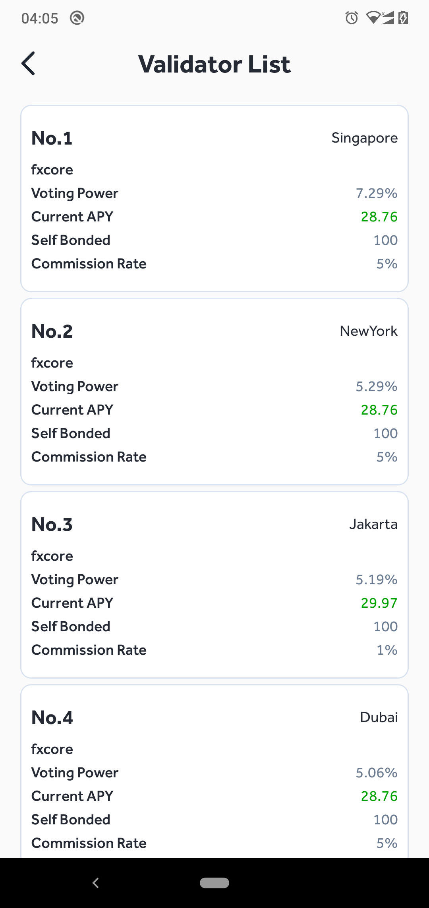
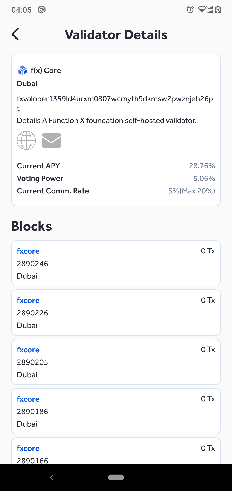

# FxDemo

Based on:

- [Android](https://developer.android.com/)
- [Kotlin](https://kotlinlang.org/)
- [JAVA](https://www.java.com/en/)

## Tech Used
- [Architecture MVVM](https://en.wikipedia.org/wiki/Model%E2%80%93view%E2%80%93viewmodel)
- [Apollo](https://www.apollographql.com/)
- [Picasso](https://square.github.io/picasso/)
- [Coroutines](https://developer.android.com/kotlin/coroutines)
- [Recycler View](https://developer.android.com/reference/kotlin/androidx/recyclerview/widget/RecyclerView)
- [DataBinding](https://developer.android.com/topic/libraries/data-binding)
- [Card View](https://developer.android.com/guide/topics/ui/layout/cardview)
- [ConstraintLayout](https://developer.android.com/training/constraint-layout)
- [Mutable LiveData](https://developer.android.com/reference/android/arch/lifecycle/MutableLiveData)
- [View Model](https://developer.android.com/topic/libraries/architecture/viewmodel)

## Support 
- Minimum SDK [21]
- Targeted SDK [31]
- Night Mode Support

## Getting started

- Clean Build
- Run application on emulator or physical device

## Screen Shot

### Home Screen

- This image show List of movies fetching from API
- View show movie poster in grid format.

### Validator List

- This image show movie description
- Show movie detail of the selected movie.

### Validator Detail

- This image show movie description
- Show movie detail of the selected movie.

